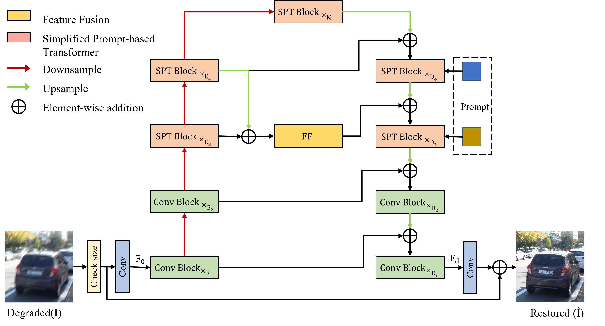
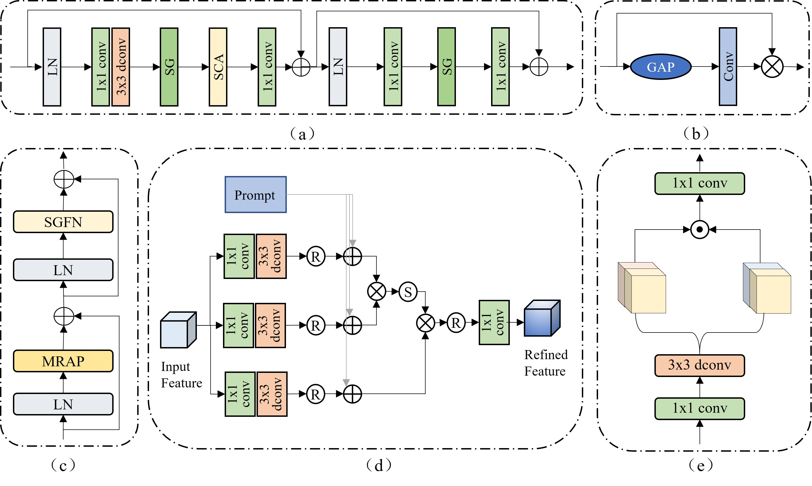

# Prompt-based Ingredient-Oriented All-in-One Image Restoration

[](https://arxiv.org/abs/2309.03063)
<hr />


> **Abstract:** Image restoration aims to recover the high-quality images from their degraded observations. Since most existing methods have been dedicated into single degradation removal, they may not yield optimal results on other types of degradations, which do not satisfy the applications in real world scenarios. In this paper, we propose a novel data ingredient-oriented approach that leverages prompt-based learning to enable a single model to efficiently tackle multiple image degradation tasks. Specifically, we utilize a encoder to capture features and introduce  prompts with degradation-specific information to guide the decoder in adaptively recovering images affected by various degradations. In order to model the local invariant properties and non-local information for high-quality image restoration, we combined CNNs operations and Transformers. Simultaneously, we made several key designs in the Transformer blocks (multi-head rearranged attention with prompts and simple-gate feed-forward network) to reduce computational requirements and selectively determines what information should be persevered to facilitate efficient recovery of potentially sharp images. Furthermore, we incorporate a feature fusion mechanism further explores the multi-scale information  to improve the aggregated features. The resulting tightly interlinked hierarchy architecture, named as CAPTNet, extensive experiments demonstrate that our method performs competitively to the  state-of-the-art.

## Network Architecture

<table>
  <tr>
    <td align="center">  </td>
  </tr>
  <tr>
    <td><p align="center"><b>Overall Framework of CAPTNet</b></p></td>
  </tr>
    <tr>
    <td align="center">  </td>
  </tr>
  <tr>
    <td><p align="center"><b>(a) The architecture of non-linear activation free block (NAFBlock). (b) Simplified channel attention (SCA). (c) Simplified prompt-based transformer (SPT) block. (d) Multi-head rearranged attention with prompts (MRAP).  (e) Simple gate feed-forward network (SGFN)</b></p></td>
</table>


## Installation
The model is built in PyTorch 1.1.0 and tested on Ubuntu 16.04 environment (Python3.7, CUDA9.0, cuDNN7.5).

For installing, follow these intructions
```
conda create -n pytorch1 python=3.7
conda activate pytorch1
conda install pytorch=1.1 torchvision=0.3 cudatoolkit=9.0 -c pytorch
pip install matplotlib scikit-image opencv-python yacs joblib natsort h5py tqdm
```

Install warmup scheduler

```
cd pytorch-gradual-warmup-lr; python setup.py install; cd ..
```

## Quick Run

To test the pre-trained models [Baidu Drive](https://pan.baidu.com/s/1tPh4vtmewpZDEAEerwz9HA ) password：Tomb

[Google Drive](https://drive.google.com/drive/folders/1aVF6aKCfCx1g7rEiFcpBYjisLrr674F4?usp=sharing)


## Training and Evaluation

#### Training 

- Train the model with default arguments by running

```
python train.py
```

#### Evaluation 
- Run
```
python test.py 
```

- To reproduce PSNR/SSIM scores of the paper , run 

```
python eval.py 
```

## Results

<!--
<details>
  <summary> <strong>Image Deblurring</strong> (click to expand) </summary>
<table>
  <tr>
    <td>  </td>
  </tr>
  <tr>
    <td><p align="center"><b>Deblurring on GoPro and HIDE Datasets.</b></p></td>
  </tr>
</table></details>

<details>
  <summary> <strong>Image Deraining</strong> (click to expand) </summary>
</details>
-->
 
## Citations
If our code helps your research or work, please consider citing our paper.
The following is a BibTeX reference:

```
@article{Gao2023PIO,
 author={Gao, Hu and Yang, Jing and Zhang, Ying and Wang, Ning and Yang, Jingfan and Dang, Depeng},
  journal={IEEE Transactions on Circuits and Systems for Video Technology}, 
  title={Prompt-based Ingredient-Oriented All-in-One Image Restoration}, 
  year={2024},
  volume={},
  number={},
  pages={1-1}
}
```


## Contact
Should you have any question, please contact two_bits@163.com

